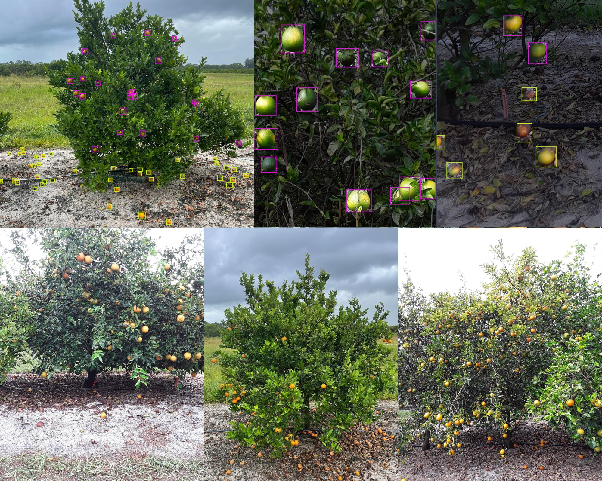

## CitDet: A Benchmark Dataset for Citrus Fruit Detection

### Overview

Despite the fact that significant progress has been made in solving the fruit
detection problem, the lack of publicly available datasets has complicated
direct comparison of results. For instance, citrus detection has long been of
interest to the agricultural research community, yet there is an absence of
work, particularly involving public datasets of citrus affected by Huanglongbing
(HLB). 

<p align="center">
  
</p>

This repository provides source code for our paper titled "[CitDet: A Benchmark
Dataset for Citrus Fruit Detection](https://arxiv.org/pdf/2309.05645.pdf)." The
CitDet dataset contains high-resolution images of citrus trees located in an
area known to be highly affected by HLB, along with high-quality bounding box
annotations of citrus fruit. Fruit on both the trees and the ground are labeled
to allow for identification of fruit location, which contributes to advancements
in yield estimation and potential measure of HLB impact via fruit drop.  In
addition, we enhance state-of-the-art object detection methods for use in
typical orchard settings and provide new benchmarks. 

More information on the project can be found on the [CitDet
website](https://robotic-vision-lab.github.io/citdet).

### Citation

If you find this project useful, then please consider citing both our paper and
dataset.

```bibitex
@article{james2023citdet,
  title={CitDet: A Benchmark Dataset for Citrus Fruit Detection},
  author={James, Jordan A and Manching, Heather K and Mattia, Matthew R and Bowman, Kim D and Hulse-Kemp, Amanda M and Beksi, William J},
  journal={arXiv preprint arXiv:2309.05645},
  year={2023}
}

@data{T8/QFVHQ5_2024,
  title={{CitDet}},
  author={James, Jordan A and Manching, Heather K and Mattia, Matthew R and Bowman, Kim D and Hulse-Kemp, Amanda M and Beksi, William J},
  publisher={Texas Data Repository},
  version={V1},
  url={https://doi.org/10.18738/T8/QFVHQ5},
  doi={10.18738/T8/QFVHQ5},
  year={2024}
}
```

## Installation
* Setup a Python 3 environment
* Install Pytorch (1.0.1 or higher) and TorchVision
* Install some other packages:
```
# Install necessary packages
pip install Pillow opencv-python sklearn numpy
```
* Clone this repository and enter it
```
git clone https://github.com/jjames71396/CitDet.git
cd CitDet
```

## Data Loader
The file ```datasets/coco.py``` contains a coco dataset class that allows loading images and masks on the fly and extract bounding boxes and segmentation masks. Modify this class accordingly if you need additional inputs to your network.

## Training, Evaluation, and Visualization
To train a network on the CitDet dataset make sure that you download the dataset first from [here](link).
The notebook ```train_eval_visualize.py``` includes example code for training, evaluating, and visualizing the predictions of a detection model.


## Evaluation
As of May 24th, 2023 here are our latest models along with their respective benchmark results.

### Citrus Detection
| Method | Backbone | AP | AP @ IoU=.50  |  AP @ IoU=.75 |
|---|---|---|---|---|
| FasterRCNN  |  ResNet50  |  0.220 | 0.514 | 0.140  |
| YOLOv5-m  |  YOLOv5 |  0.348 |  0.700 | 0.299  |
| YOLOv7-m  | YOLOv7  | 0.406 |  0.778 | 0.368  |

### Tiled Citrus Detection
| Method | Backbone | AP | AP @ IoU=.50  |  AP @ IoU=.75 |
|---|---|---|---|---|
| YOLOS  |  ViT  |  0.324 | 0.707 | 0.246  |
| DETR  |  ResNet50 |  0.350 |  0.728 | 0.288  |
| FasterRCNN  |  ResNet50  |  0.372 | 0.760 | 0.315  |
| YOLOv5-m  |  YOLOv5 |  0.449 |  0.818 | 0.434  |
| YOLOv7-m  | YOLOv7  | 0.455  |  0.832 | 0.439  |


