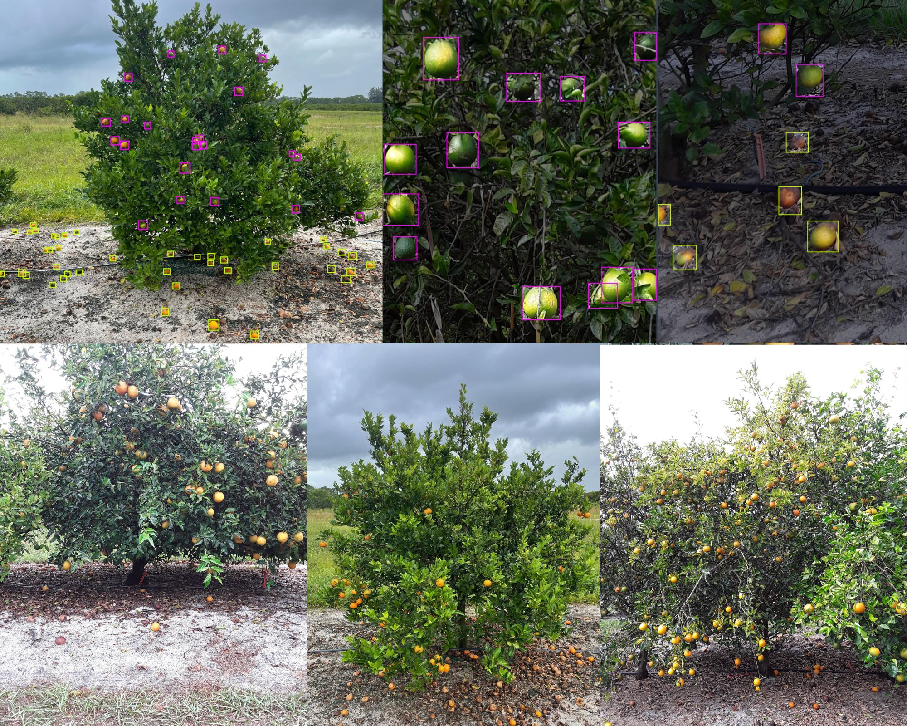

# CitDet: A Benchmark Dataset for Detecting Citrus
This is the code to our [paper]() CitDet: A Benchmark Dataset for Detecting Citrus. We provide example scripts and notebooks for loading data, training DETR on the CitDet dataset and example evaluation and visualization.

<p align="center">
	
</p>

## Evaluation
As of May 24th, 2023 here are our latest models along with their respective benchmark results.

### Citrus Detection
| Method | Backbone | AP | AP @ IoU=.50  |  AP @ IoU=.75 |
|---|---|---|---|---|
| FasterRCNN  |  ResNet50  |  0.220 | 0.514 | 0.140  |
| YOLOv5-m  |  YOLOv5 |  0.348 |  0.700 | 0.299  |
| YOLOv7-m  | YOLOv7  | 0.406 |  0.778 | 0.368  |

### Tiled Citrus Detection
| Method | Backbone | AP | AP @ IoU=.50  |  AP @ IoU=.75 |
|---|---|---|---|---|
| YOLOS  |  ViT  |  0.324 | 0.707 | 0.246  |
| DETR  |  ResNet50 |  0.350 |  0.728 | 0.288  |
| FasterRCNN  |  ResNet50  |  0.372 | 0.760 | 0.315  |
| YOLOv5-m  |  YOLOv5 |  0.449 |  0.818 | 0.434  |
| YOLOv7-m  | YOLOv7  | 0.455  |  0.832 | 0.439  |

## Installation
* Setup a Python 3 environment
* Install Pytorch (1.0.1 or higher) and TorchVision
* Install some other packages:
```
# Install necessary packages
pip install Pillow opencv-python sklearn numpy
```
* Clone this repository and enter it
```
git clone https://github.com/jjames71396/CitDet.git
cd CitDet
```

## Data Loader
The file ```datasets/coco.py``` contains a coco dataset class that allows loading images and masks on the fly and extract bounding boxes and segmentation masks. Modify this class accordingly if you need additional inputs to your network.

## Training, Evaluation, and Visualization
To train a network on the CitDet dataset make sure that you download the dataset first from [here](link).
The notebook ```train_eval_visualize.py``` includes example code for training, evaluating, and visualizing the predictions of a detection model.


## Citation
If you use CitDet or this code base in your work, please cite
